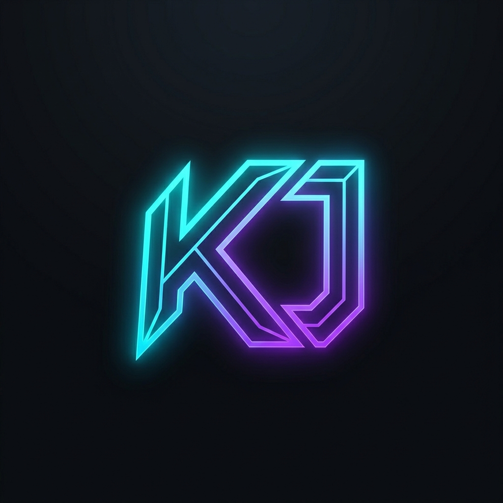

<p align="center">
  
</p>

# 🚀 Kavya Jain | GenAI Engineer & Full-Stack Builder

Welcome to the source code for my personal portfolio! This is a highly interactive, 3D-integrated, cyberpunk-themed portfolio built to showcase my expertise in Generative AI pipelines, modern web development, and immersive UI/UX design.

## 🌐 Live URL
[kavyajain.vercel.app](https://kavyajain.vercel.app/) *(Replace with your actual link if different)*

---

## ✨ Features

- **3D Interactive Hero Section**: Custom-loaded and optimized FBX 3D robot model that tracks cursor movement using `Three.js`.
- **Cyberpunk Aesthetics**: Glassmorphism UI, custom neon glows, animated grid backgrounds, and a cohesive dark-mode theme.
- **Performant Animations**: Butter-smooth page transitions, staggered reveals, and scroll animations powered by `Framer Motion`.
- **Responsive Layout**: Carefully tuned for mobile, tablet, and desktop viewing without compromising the complex UI elements.
- **Serverless Ready**: Built with Next.js 14 App Router, fully optimized for Vercel deployment with rapid edge-caching.

---

## 🛠️ Tech Stack

- **Framework**: [Next.js 14](https://nextjs.org/) (App Router)
- **Language**: [TypeScript](https://www.typescriptlang.org/)
- **Styling**: [Tailwind CSS](https://tailwindcss.com/)
- **3D Rendering**: [Three.js](https://threejs.org/)
- **Animations**: [Framer Motion](https://www.framer.com/motion/)
- **Icons**: [Lucide React](https://lucide.dev/)
- **Deployment**: [Vercel](https://vercel.com)

---

## 🚀 Getting Started

To run this project locally on your machine, follow these steps:

### Prerequisites
Make sure you have [Node.js](https://nodejs.org/) (v18+) and npm installed.

### Installation

1. **Clone the repository:**
   ```bash
   git clone https://github.com/Kavya-Jain-coder/kavya-jain-portfolio.git
   cd kavya-jain-portfolio
   ```

2. **Install dependencies:**
   ```bash
   npm install
   ```

3. **Start the development server:**
   ```bash
   npm run dev
   ```

4. **View the site:**
   Open [http://localhost:3000](http://localhost:3000) in your browser.

---

## 📁 Project Structure

```text
├── src
│   ├── app               # Next.js App Router (Pages, Layouts, Globals)
│   ├── components        
│   │   ├── three         # Three.js Canvas & 3D Model Components
│   │   └── ui            # Reusable UI Components (Cards, Buttons, Timeline)
│   └── lib               # Utility functions and Animation variants
├── public                
│   ├── ai-robot          # 3D FBX files and textures
│   └── bg                # Pre-optimized background images
└── tailwind.config.ts    # Tailwind theme extension & custom neon colors
```

---

## 💡 About Me

I am a B.Tech Artificial Intelligence & Machine Learning student at Newton School of Technology. I specialize in building production-grade GenAI pipelines, RAG systems, and immersive web applications. 

Feel free to download my [Resume](./public/AI-Resume-Kavya_Jain.pdf) or contact me via the site to see more of my work!
